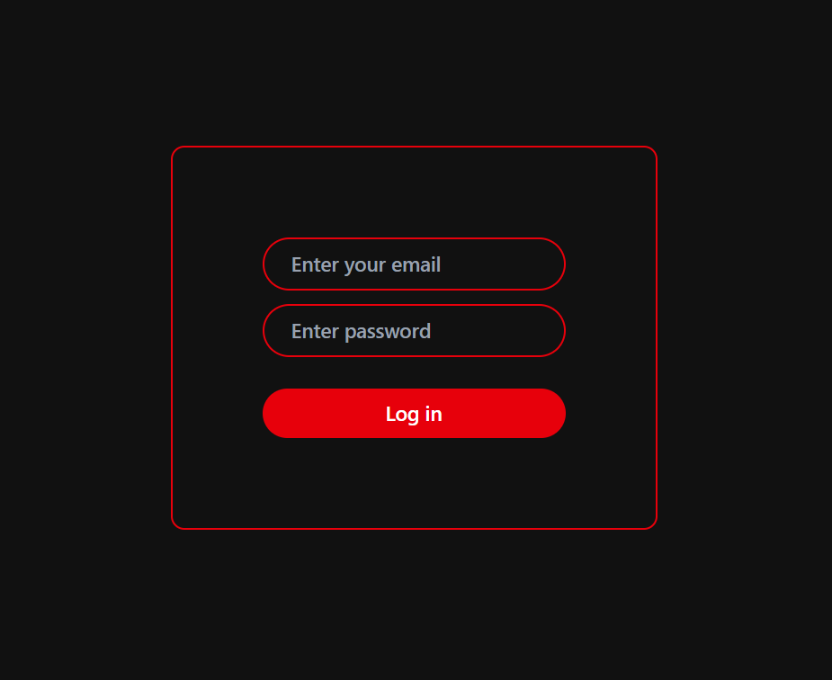
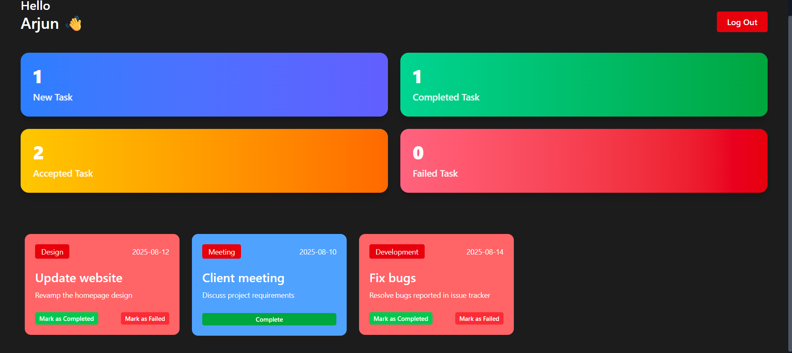
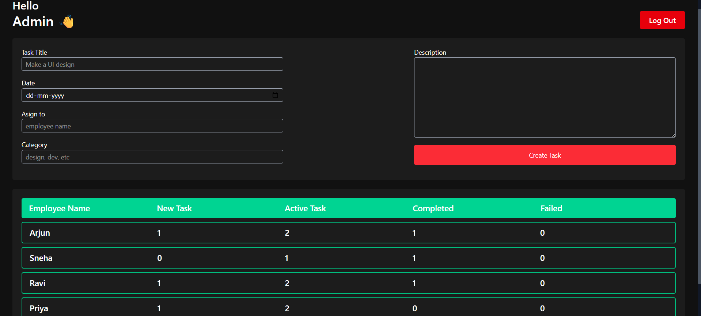

# Employee Task Management System  

A web-based task management application that allows **Admins** to assign tasks and track progress, while **Employees** can view, accept, and update their task status in real-time.  

## ✨ Features  

- 👨‍💼 **Admin Dashboard**  
  - Assign tasks with title, description, category, and deadline  
  - Track each employee’s tasks and their progress (New, Active, Completed, Failed)  

- 👩‍💻 **Employee Dashboard**  
  - View assigned tasks  
  - Accept tasks and mark them as **Completed** or **Failed**  
  - Live task counter (New, Active, Completed, Failed)  

- 🎨 **UI & Styling**  
  - Built with **Tailwind CSS** for modern responsive design  
  - Custom scrollbar and clean dashboard layout  

- 🔐 **Authentication**  
  - Login system for Admins and Employees  

## 🛠️ Tech Stack  

- **Frontend:** React, Vite  
- **Styling:** Tailwind CSS  
- **State Management:** React hooks (`useState`, `useEffect`)  
- **Other Tools:** Custom reusable components  

## 📸 Screenshots  

### 🔑 Login Page  


### 📊 Employee Dashboard  


### 🛠️ Admin Dashboard  


## 🔐 Demo Login Credentials  

You can use the following credentials to test the application:  

### 👨‍💼 Admin Login  
- **Email:** admin@me.com  
- **Password:** 123  

### 👩‍💻 Employee Login  
- **Email:** employee1@example.com, employee2@example.com, employee3@example.com, employee4@example.com, employee5@example.com
- **Password:** 123  


## 🚀 Getting Started  

Follow these steps to run the project locally:  

```bash
# Clone the repo
git clone https://github.com/Divcroot/Employee-Task-Management-System.git  

# Go to the project folder
cd Employee-Task-Management-System

# Install dependencies
npm install  

# Run the development server
npm run dev  
